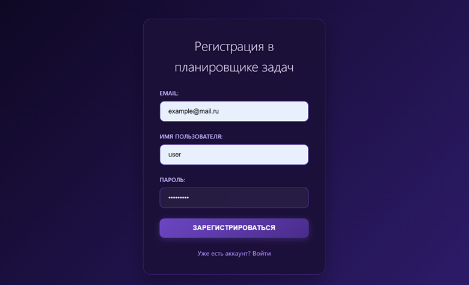
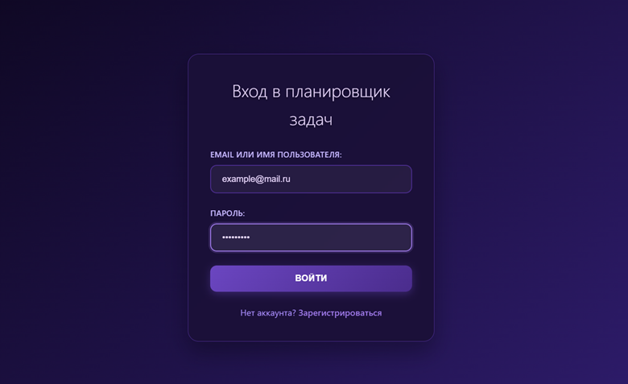
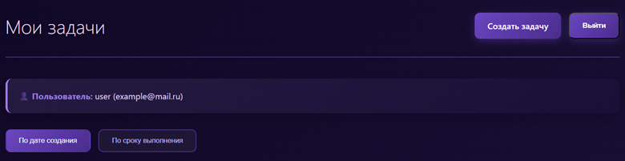
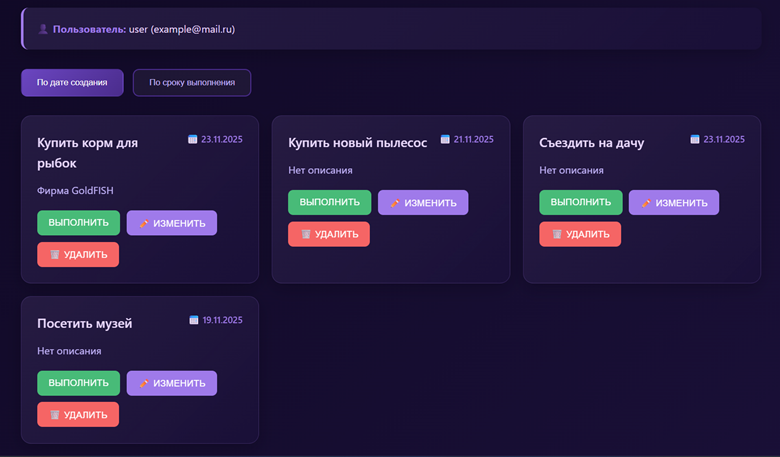
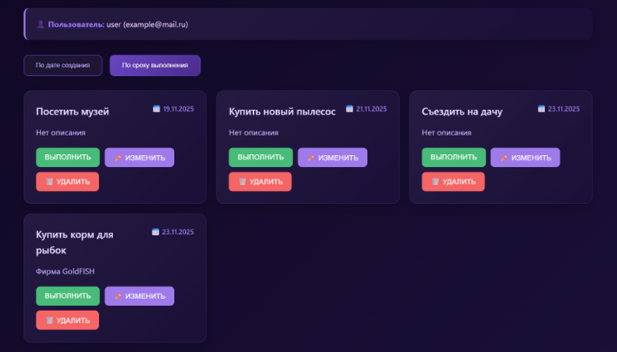
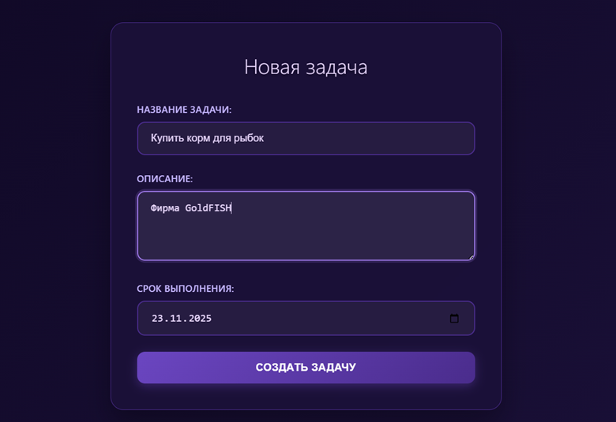
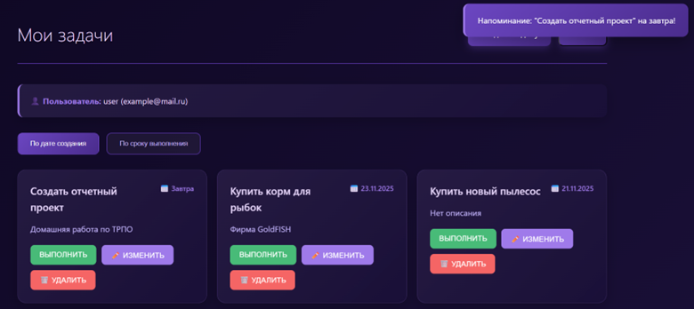

# Планировщик задач

Веб-приложение для управления задачами и временем с современным темно-фиолетовым интерфейсом.

## Основные функции

-  **Аутентификация пользователей** - регистрация и вход по email/username
-  **Создание задач** - с названием, описанием и сроком выполнения 
-  **Просмотр задач** - с сортировкой по дате создания или сроку выполнения
-  **Управление задачами** - редактирование, удаление, отметка выполнения
-  **Уведомления** - оповещения о приближающихся сроках

## Технологии

- **Backend**: Python, Flask, Flask-SQLAlchemy
- **Frontend**: HTML, CSS, JavaScript
- **Database**: PostgreSQL
- **Аутентификация**: JWT (JSON Web Tokens)
- **Хэширование паролей**: bcrypt

## Быстрый старт

Следуйте инструкции в [SETUP.md](SETUP.md) для установки и настройки приложения.

## Скриншоты и реализация функций

### Начало работы

Начало работы начинается с окна регистрации, где необходимо ввести свою почту, имя пользователя и пароль.

Если у вас уже есть аккаунт вы можете использовать окно входа.

### Основной интерфейс

После успешной авторизации открывается главная страница со списком задач. Здесь можно создать задачу, отсортировать задачи и выйти из приложений.

Также здесь отображаются все созданные вами задачи с возможностью сортировки по дате создания или сроку выполнения.

Сортировка по дате создания:

Сортировка по сроку выполнения:    

Каждая задача содержит название, описание, срок выполнения и кнопки управления. Вы можете отметить задачу как выполненную, отредактировать или удалить её.

### Создание задач

Для создания новой задачи нажмите кнопку "Создать задачу". В открывшейся форме укажите название, описание (необязательно) и срок выполнения задачи.

### Редактирование задач

Любую задачу можно отредактировать - для этого нажмите кнопку "Изменить" рядом с нужной задачей. Откроется модальное окно с формой редактирования.

### Уведомления

Система автоматически уведомляет вас о задачах, срок выполнения которых приближается. Уведомления появляются в правом верхнем углу экрана.

## API Endpoints

### Аутентификация
- `POST /api/register` - Регистрация нового пользователя
- `POST /api/login` - Вход в систему
- `GET /api/verify-token` - Проверка валидности токена

### Задачи
- `GET /api/tasks` - Получить список задач (с параметром `sort`)
- `POST /api/tasks` - Создать новую задачу
- `PUT /api/tasks/<id>` - Обновить задачу
- `DELETE /api/tasks/<id>` - Удалить задачу
- `GET /api/upcoming-tasks` - Получить задачи с истекающим сроком
